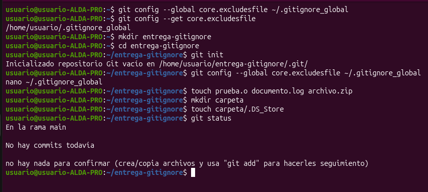
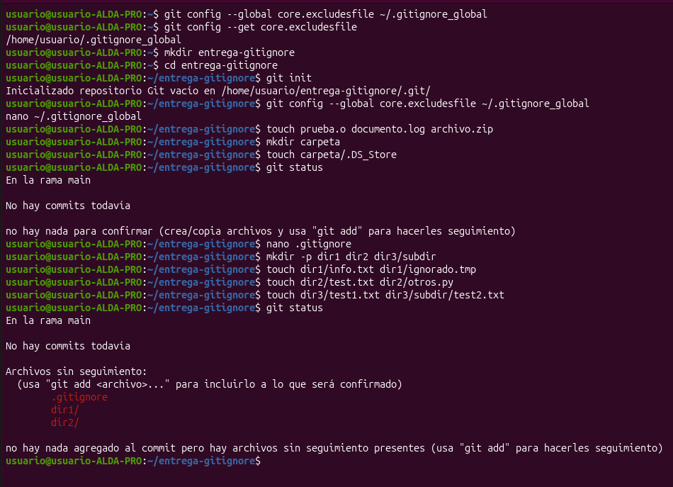
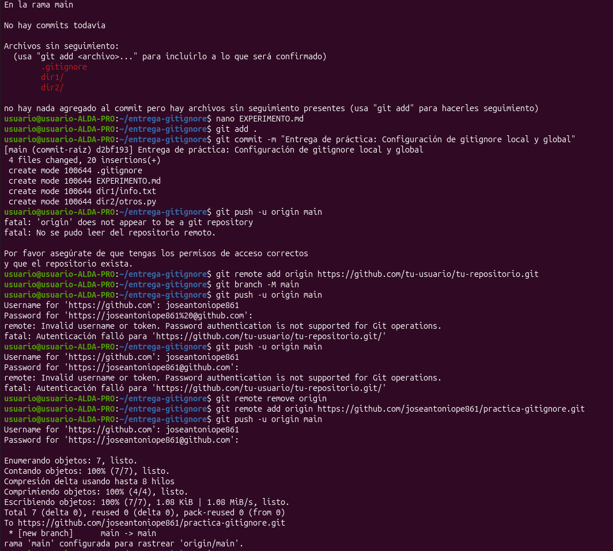

# Experimento con Gitignore: Configuración Global y Local

Este documento detalla las pruebas realizadas para comprender el funcionamiento de las reglas de exclusión en Git, tanto a nivel global del sistema como a nivel local del repositorio.

## 1. Configuración y Prueba de `.gitignore_global`

Primero, configuramos Git para que utilice un archivo de exclusión global ubicado en el directorio del usuario:
\`\`\`bash
git config --global core.excludesfile ~/.gitignore_global
\`\`\`

Dentro de este archivo, añadimos patrones genéricos (`*.o`, `*.log`, `*.zip`, `.DS_Store`).

**Prueba:**
Creamos archivos simulando estos formatos (`prueba.o`, `documento.log`, `archivo.zip` y `carpeta/.DS_Store`). Al ejecutar \`git status\`, la terminal devolvió el mensaje "no hay nada para confirmar", demostrando que Git ignoró estos archivos automáticamente en todo el sistema.

## 2. Configuración y Prueba de `.gitignore` Local

A continuación, creamos un archivo `.gitignore` en la raíz del repositorio local con las siguientes reglas:
- `dir1/*` (Ignora todo en dir1)
- `!dir1/info.txt` (Excepción: NO ignorar info.txt)
- `dir2/*.txt` (Ignora archivos .txt en dir2)
- `dir3/**/*.txt` (Ignora archivos .txt en dir3 y sus subcarpetas)
- `*.o` (Ignora archivos .o localmente)

**Prueba:**
Creamos la estructura de directorios y archivos correspondientes. Al ejecutar \`git status\`, el resultado mostró únicamente como "Archivos sin seguimiento" a `.gitignore`, `dir1/` (por la excepción del `info.txt`) y `dir2/` (por el archivo `otros.py`). Todo el contenido de `dir3` fue ignorado correctamente.

## 3. Subida al Repositorio Remoto

Finalmente, conectamos el repositorio local con GitHub mediante un Token de acceso y realizamos el `push` de los archivos permitidos exitosamente.

## Conclusiones y Diferencias

* **Global (`.gitignore_global`):** Se aplica a nivel de usuario en el sistema operativo. Ideal para excluir archivos basura generados por el propio sistema o editor de código en todos los proyectos de la máquina.
* **Local (`.gitignore`):** Se aplica únicamente al repositorio donde se encuentra. Se sube al repositorio remoto para que todos los colaboradores del equipo compartan las mismas reglas de exclusión del proyecto.
